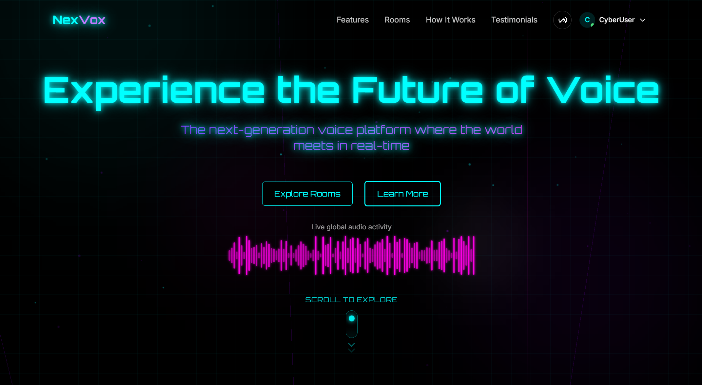

# Nexvox

A next-generation voice room social media platform with immersive spatial audio and cyberpunk-inspired design.



## 🔊 Overview

Nexvox is a cutting-edge social platform that reimagines online communication through voice rooms with spatial audio technology. Designed with a futuristic cyberpunk aesthetic, Nexvox offers users a unique way to connect through immersive audio experiences in virtual spaces.

**Live URL**: [https://nexvox.vercel.app/](https://nexvox.vercel.app/)

## ✨ Key Features

- **Immersive Voice Rooms**: Create and join voice rooms with spatial audio technology that simulates real-world sound positioning.
- **Live Rooms**: Discover active conversations happening in real-time across different categories and interests.
- **Ambient Rooms**: Background audio environments to enhance productivity, relaxation, or focus.
- **Rich User Profiles**: Customizable profiles with detailed statistics and personalization options.
- **Friend System**: Connect with others, see who's online, and join rooms together.
- **Real-time Chat**: Text chat functionality within voice rooms for enhanced communication.
- **Room Sharing**: Easily share room invitations via QR codes and links.
- **Cyberpunk UI/UX**: Visually stunning interface with neon aesthetics, particle effects, and smooth animations.
- **Responsive Design**: Fully optimized for both desktop and mobile experiences.

## 🛠️ Tech Stack

- **Framework**: Next.js 15
- **Frontend**: React 19, TypeScript
- **Styling**: Tailwind CSS 4
- **Animations**: Framer Motion, GSAP, AOS (Animate On Scroll)
- **Visual Effects**: TSParticles, React Parallax Tilt
- **Audio**: Web Audio API with custom spatial audio implementation
- **UI Components**: Custom components with MAGIC, ACETERNITY, REACTBITS UI integration

## 🏗️ Architecture

The application follows a modern React architecture with:

- **Next.js App Router**: For efficient page routing and server components
- **Context API**: For global state management (UserContext, FriendContext)
- **Custom Hooks**: For reusable logic and functionality
- **Component-Based Design**: Modular components for maintainability
- **Progressive Enhancement**: Core functionality works without JavaScript, enhanced with client-side features

## 🚀 Getting Started

### Prerequisites

- Node.js 18.0 or higher
- npm or yarn

### Installation

1. Clone the repository:
   ```bash
   git clone https://github.com/yourusername/nexvox.git
   cd nexvox
   ```

2. Install dependencies:
   ```bash
   npm install
   # or
   yarn install
   ```

3. Run the development server:
   ```bash
   npm run dev
   # or
   yarn dev
   ```

4. Open [http://localhost:3000](http://localhost:3000) in your browser.

## 🔍 Project Structure
