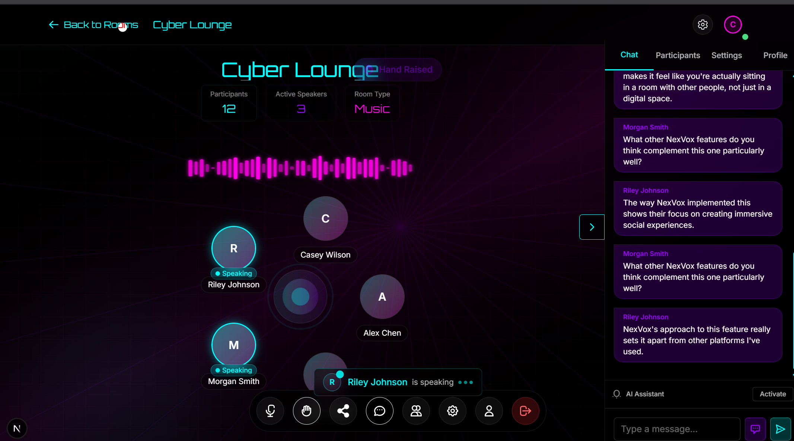

# Nexvox

A next-generation voice room social media platform with immersive spatial audio and cyberpunk-inspired design.




## 🔊 Overview

Nexvox is a cutting-edge social platform that reimagines online communication through voice rooms with spatial audio technology. Designed with a futuristic cyberpunk aesthetic, Nexvox offers users a unique way to connect through immersive audio experiences in virtual spaces.

## ✨ Key Features

- **Immersive Voice Rooms**: Create and join voice rooms with spatial audio technology that simulates real-world sound positioning.
- **Live Rooms**: Discover active conversations happening in real-time across different categories and interests.
- **Ambient Rooms**: Background audio environments to enhance productivity, relaxation, or focus.
- **Rich User Profiles**: Customizable profiles with detailed statistics and personalization options.
- **Friend System**: Connect with others, see who's online, and join rooms together.
- **Real-time Chat**: Text chat functionality within voice rooms for enhanced communication.
- **Room Sharing**: Easily share room invitations via QR codes and links.
- **Cyberpunk UI/UX**: Visually stunning interface with neon aesthetics, particle effects, and smooth animations.
- **Responsive Design**: Fully optimized for both desktop and mobile experiences.

## 🛠️ Tech Stack

- **Framework**: Next.js 15
- **Frontend**: React 19, TypeScript
- **Styling**: Tailwind CSS 4
- **Animations**: Framer Motion, GSAP, AOS (Animate On Scroll)
- **Visual Effects**: TSParticles, React Parallax Tilt
- **Audio**: Web Audio API with custom spatial audio implementation
- **UI Components**: Custom components with MAGIC, ACETERNITY, REACTBITS UI integration

## 🏗️ Architecture

The application follows a modern React architecture with:

- **Next.js App Router**: For efficient page routing and server components
- **Context API**: For global state management (UserContext, FriendContext)
- **Custom Hooks**: For reusable logic and functionality
- **Component-Based Design**: Modular components for maintainability
- **Progressive Enhancement**: Core functionality works without JavaScript, enhanced with client-side features

## 🚀 Getting Started

### Prerequisites

- Node.js 18.0 or higher
- npm or yarn

### Installation

1. Clone the repository:
   ```bash
   git clone https://github.com/yourusername/nexvox.git
   cd nexvox
   ```

2. Install dependencies:
   ```bash
   npm install
   # or
   yarn install
   ```

3. Run the development server:
   ```bash
   npm run dev
   # or
   yarn dev
   ```

4. Open [http://localhost:3000](http://localhost:3000) in your browser.

## 🔍 Project Structure

```
nexvox/
├── src/ # Source code directory
│ ├── app/ # Next.js App Router pages
│ │ ├── chats/ # Chat system pages
│ │ ├── friends/ # Friend management pages
│ │ ├── login/ # Authentication
│ │ ├── profile/ # User profiles
│ │ ├── register/ # User registration
│ │ ├── rooms/ # Voice room system
│ │ │ ├── [roomId]/ # Dynamic route for single room page
│ │ │ │ └── page.tsx # Individual room component
│ │ │ └── page.tsx # Rooms listing component
│ │ ├── settings/ # User settings
│ │ ├── data/ # Data API routes
│ │ ├── globals.css # Global CSS styles
│ │ ├── layout.tsx # Root layout component
│ │ └── page.tsx # Homepage component
│ ├── components/ # Reusable UI components
│ │ ├── home/ # Homepage-specific components
│ │ ├── rooms/ # Room-related components
│ │ │ ├── RoomCard.tsx # Room preview component
│ │ │ ├── RoomControls.tsx # Audio controls for rooms
│ │ │ └── voice/ # Voice room components
│ │ ├── chat/ # Chat interface components
│ │ ├── Header.tsx # Navigation header
│ │ ├── GlowButton.tsx # Custom button with glow effect
│ │ ├── HolographicCard.tsx # Holographic card component
│ │ ├── ParticlesBackground.tsx # Particle effects background
│ │ ├── AudioWaveform.tsx # Audio visualization component
│ │ ├── LoadingScreen.tsx # Loading state component
│ │ ├── PageTransition.tsx # Page transition animations
│ │ └── ... (35+ more UI components)
│ ├── contexts/ # React Context providers
│ ├── hooks/ # Custom React hooks
│ ├── lib/ # Library code and utilities
│ ├── styles/ # Component-specific styles
│ ├── types/ # TypeScript type definitions
│ ├── utils/ # Utility functions
│ ├── data/ # Data models and fixtures
│ └── public/ # Static assets (internal)
├── public/ # Public static assets
│ ├── nexvox_image.png # Main application image
│ ├── audios/ # Audio files
│ ├── assets/ # Other static assets
│ ├── icons/ # Icon assets
│ └── ... (favicon files and other assets)
├── .next/ # Next.js build output
├── node_modules/ # Package dependencies
├── package.json # Project configuration
├── package-lock.json # Dependency lock file
├── tsconfig.json # TypeScript configuration
├── next.config.ts # Next.js configuration
├── postcss.config.mjs # PostCSS configuration
└── eslint.config.mjs # ESLint configuration                 
```

## 🎨 Design Principles

Nexvox follows these core design principles:

1. **Immersive Experience**: Creating a sense of presence through spatial audio and visual design.
2. **Intuitive Navigation**: Despite the futuristic aesthetics, the UX remains intuitive and accessible.
3. **Performance First**: Optimized animations and effects to ensure smooth performance even on lower-end devices.
4. **Visual Hierarchy**: Clear visual indicators for interactive elements and important information.
5. **Responsive Design**: Fully functional across all device sizes with tailored experiences.

## 🔮 Future Roadmap

- End-to-end encryption for private rooms
- AI-powered background noise cancellation
- Virtual environment visualizers
- Integration with external music streaming services
- Multi-language support

## ❤️ Acknowledgements

We extend our heartfelt gratitude to everyone who has explored and supported Nexvox. This project is crafted with passion and dedication by Soorya Krishna. 

Feel free to connect with Soorya on [LinkedIn](https://www.linkedin.com/in/sooryakrishna) for more insights and updates.
